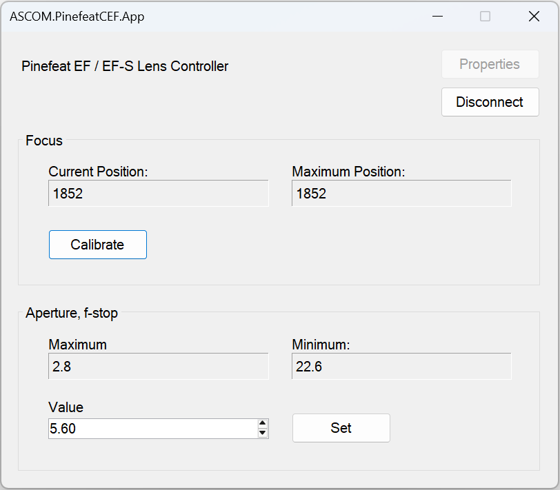

# EF / EF-S Lens Controller & Adapter for Astronomy Camera – Canon® Lens Compatible

[Pinefeat](https://www.pinefeat.co.uk) produces the adapter designed to interface between [Canon EF](https://www.canon.co.uk/store/ef-lenses/) & [EF-S lenses](https://www.canon.co.uk/store/ef-s-lenses/) and non-Canon camera bodies, incorporating features for electronic focus and aperture adjustments. The adapter has a built-in USB port and provides a software programming interface that allows control of the lens's focus and aperture positions.

_PinefeatCEF_ is the ASCOM focuser driver that allows you to use the adapter with the ASCOM platform. 

The solution allows **Canon EF** and **EF-S lenses** to be used for **astrophotography**. In addition to mechanical mounting, it provides electronic control of lens focus and aperture via astronomical imaging software.

## 🔗 Connecting the Adapter

The adapter supports USB CDC (Communications Device Class) and emulates serial communication over USB. When connected, the USB device appears as a serial port on the host system.

**Note**: Before connecting the lens, disconnect the adapter from the USB cable.

## 🧪 Quick test

The adapter features a **Self-Test Mode** to verify focus and aperture communication with the lens.

To activate Self-Test Mode, ensure the adapter is powered on, then toggle the **AF/MF switch** on the lens **three times within 15 seconds**. This will run a test sequence:
- _Focus Test_: moves focus from **minimum** to **infinity**, then back to **minimum** in **four steps**.
- _Aperture Test_: **closes** the aperture fully, then **reopens** it gradually in **four steps** to the maximum aperture.

This sequence lasts for a few seconds and confirms that the adapter is communicating correctly with the lens.

Keep in mind that STM lenses are designed to be very quiet, and their focus movements are often smooth and hard to notice. If you're unsure whether the motor is working, try placing your ear close to the lens to listen for engagement.

If the lens does not complete any part of this sequence and the issue persists after repeated attempts, it indicates that the lens and adapter are not fully compatible. In such cases, some or all electronic functions (focus and/or aperture control) may not operate reliably.

Note: Self-Test Mode does not affect any camera or lens settings and can be safely repeated at any time.

## ⚙️ Installing the driver

1. Download the installer from the [release](https://github.com/pinefeat/cef135/releases) **Assets** section.

2. Run the `.exe` file and complete the installation.

3. The driver will appear in ASCOM device lists automatically.

## 🔧 Configuration

Open the ASCOM Device Hub, choose focuser _Pinefeat EF / EF-S Lens Controller_. Select the adapter's serial port in the focuser properties.

Run the focuser application _ASCOM PinefeatCEF App_, click Connect.

**Important!** Upon connection, click _Calibrate_ at least once to determine total number of focus steps.

The calibration procedure **must be run at least once** for each lens. No need to worry about the starting lens position. The driver will automatically traverse the full focus range, from minimum to infinity, and store the total number of focus steps. The determined value will be displayed in the _Maximum position_ property.

## Aperture control

The application displays lens aperture range in f-stops and can sets the lens's aperture to an f-stop value. 

Canon lenses do not report the current aperture, so aperture controls are write-only. If the lens aperture range is from f/5.6 to f/22.6, you can set the minimum aperture by passing `22.6` value, this will close the shutter as much as possible. To fully open the shutter, pass the value `5.6`. Any value in between will partially open the shutter.

In zoom lenses, the aperture range varies as the focal length changes. The controller will check the possible maximum and minimum aperture values before sending the value to the lens. If the values are out of range, the lens will not engage.

## 🔭 Using the Focuser

The lens must be set to AF (Autofocus) mode for autofocus or focus control via the serial interface to work. If the lens is in Manual Focus (MF) mode, the controller will return an error.

Ensure that you have **completed** the one-time **calibration** for the lens.

Once the focuser is configured via the ASCOM Device Hub, it can be used directly in the astronomical imaging software.

## 💡 Troubleshooting

If you're experiencing issues with the setup or the adapter, please refer to our [troubleshooting guide](troubleshooting.md) for more help.
